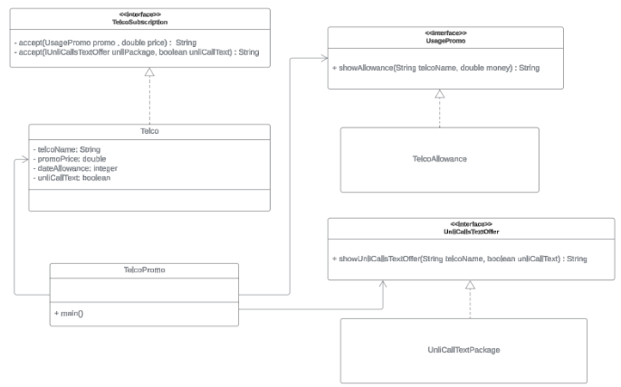

# visitorPatternExercise
Imagine you are looking for a new mobile plan for your smartphone. Three major telecommunication providers are offering enticing deals: Smart, Globe, and Ditto.

1. Smart: Offers a data allowance of 15 GB for ₱500 per month. However, they do not offer any free calls or texts, and you will be charged per use.
2. Globe: Provides a data allowance of 10 GB for ₱450 per month. This plan comes with unlimited calls and texts to subscribers within their network. Calls and texts to other networks are charged extra.
3. Ditto: Offers a data allowance of 8 GB for ₱400 per month. This plan includes unlimited calls and texts to all networks within the country.

## UML Class Diagram
